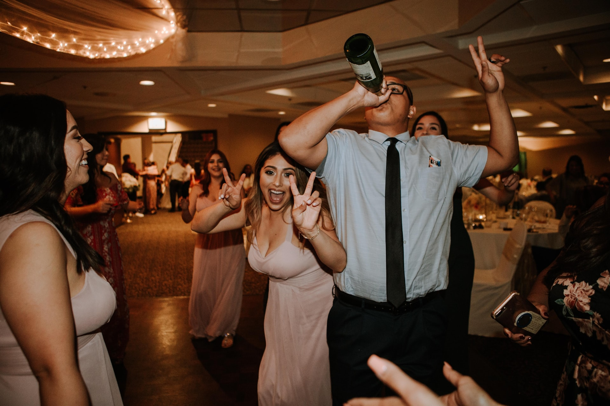

# **Tipsy Mac Staggers** #

## **Introduction** ##

The Tipsy Mac Staggers website was created and built by Stephen Mc Govern. The aim of the website is to act as a drinks data base where users can search for a new drink/cocktail. The site will provide all of the ingredients, quantaties and instructions to make each drink.

Registered users will also be able to upload their own drinks recepies that they have made so other users can sample another users twist on an established classic drink. 

**ADDITIONAL FEATURES**

> 
## **Table of contents** ## 

## **1. User Experience (UX)** ##
* 1.1 Target audience
* 1.2 Visitor goals
* 1.3 User stories
* 1.4 Design choices
* 1.5 Wire frames

## **2. Features** ##
* 2.1 The Navbar
* 2.2 Search Drinks Feature 
* 2.3 The Footer
* 2.4 User Profile 
* 2.5 Add Drink 
* 2.6 Contact Us Form

## **3. Technologies/Languages Used** ##
* 3.1 Gitpod
* 3.2 HTML5
* 3.3 CSS
* 3.4 JavaScript
* 3.5 Materialize
* 3.6 Google fonts
* 3.7 Font Awesome
* 3.8 W3schools
* 3.9 Balsamiq
* 3.10 Email JS 
* 3.11 Favicon Generator 

## **4. Testing** ##
* 4.1 See [testing.md](testing.md) document 

## **5. Deployment** ##
* 5.1 Deployment
* 5.2 Cloning
* 5.3 Cloning Desktop

## **6. Credits** ##
* 6.1 Media
* 6.2 Code 
* 6.3 Acknowledgements

## **7. Contact Me** ##
* 7.1 LinkedIn
* 7.2 Email
* 7.3 Skype

## **8. Disclaimer** ##
* 8.1 Disclaimer on project
>

## **1. User Experience (UX)** ##

### **1.1 - Target Audience** ###

* This website is aimed at anyone who is looking for instructions on how to make a cocktail/drink that they may not be familiar with or are unsure about what ingredients, quantaties and steps to follow to make that drink. The site is built around user engagement and all users are encouraged to register and add their favourite drinks to the site. 

### **1.2 - Visitor goals** ###

### **1.3 - User Stories** ###

**As a visitor to Tipsy mac Staggers i want/expect/need:**

* A simple user friendly site where i can get information of different types of cocktails/drinks that i am looking to try. I want the layout of the site to be simple and to make sense so I am not confused or put off using it.
* I want the information I am presented with to be laid out in a way that is easy for me to navigate.
* I may be viewing the site from a mobile phone or tablet. I want the site to have been designed responsively so that it is still easy to navigate and use on my mobile device.
* I also expect to be able to connect to the sites social media channels with a simple click so i can keep up to date with anything that the site admins may post there. 
* Finally as a user I expect feedback from the website I am using when I interact with it. If i send a message to the website i would like a confirmation that my message has been sent successfully. 

### **User Experience Walk through** ### 

### **1.4 - Design Choices** ###

* As the website is a site used for drink recepies I wanted it to be bright, simple to use and have a fun looking font. 

**FONTS**

* For the website i decided to use the google font style of Nixie One. This font is a mixture of neon tubes signage and a typewriter and it is a font that sits well with the colour scheme i went with. The link to the Nixie One font on Google Font can be found by clicking: [Here](https://fonts.google.com/specimen/Nixie+One?query=nix#standard-styles)

**ICONS**

* I also decided to incorporate some icons throughout the website. I did this because icons give a more visually pleasing experience for the user and also create a more intuative user experience. For the social media icons i used (Instagram, YouTube, Facebook, Twitter) All the social media icons are located in the footer of the page.

* Some of the icons on the site were taken from the Font Awesome website. The link to the Font Awesome website can be found by clicking: [Here](https://fontawesome.com/)

* The other icons i used were direct from Materialize. They can be viewed by clicking [Here](https://materializecss.com/icons.html)

**COLOURS**

* I used the website Coolors when deciding on which colours to use. This free website uses a generator to run through different colours and palletts that will match and compliment each other. The website can be found by clicking this link: [Click Here](https://coolors.co/)

* For the base colours i decided to go with the following colour palette:

<!--  -->

### **1.5 - Wire Frames** ###

### **2.1 - The Navbar** ###

For the Navbar i decided to use a Materialize mobile collapse navbar. I chose this option because i wanted the Navbar to be responsive on all screen sizes and the Materialize mobile collapse navbar offers this function. 

<!--  -->

The Navbar on each page is standardized, the page name "Tipsy Mac Stagger's" is located on the left hand side of the navbar. On the right hand side there are `<a>` tags that link to different pages. A registered and logged in user will see different buttons/options than an unregistered user. For an unregistered user the buttons/options they will see are:   

1. Home
2. Register
3. Log In

For an registered user the buttons/options they will see are:   

1. Home
2. Profile
3. Add Drink
4. Log Out

On smaller screen sizes the navbar will collapse, the name "Tipsy Mac Staggers" will relocate to the middle of the navbar and the buttons/options will collapse into a hamburger menu on the right that when clicked will expand and reveal the nav bar bottons/options.

<!--  -->

### **2.7 - Contact Us Form** ###

The contact us form has Email JS operating on the backend. Once a user clicks ont he send message button an alert will populate to show the user the message was sent. Email JS will also send an auto reply to the user to let them know their message was successfully received and that we will be back in contact with them.

I have also created a caps lock notification for the email input so the user will get a pop up alert if they have caps lock on when they try and enter their email address. 

<!--  -->

### **2.8 - The Footer** ###

In the footer i have listed all of the companies social media links. As with the navbar, the footer is identical on each page to maintain consistency no matter what page the user finds themselves on.

<!--  -->

>
## **3. Technologies/Languages Used** ##

* 3.1 - [Gitpod](https://www.gitpod.io/) - Is the IDE recommended for Code Institute students and the one i chose to develop this project in.
* 3.2 - [HTML5](https://html.com/html5/#What_is_HTML) - This is the markup language i used for this project. 
* 3.3 - [CSS](https://en.wikipedia.org/wiki/CSS) - I used CSS to help alter and adjust the presentation of the website to create a pleasant user experience. 
* 3.4 - [JavaScript](https://en.wikipedia.org/wiki/JavaScript) - JavaScript often abbreviated as JS, is a programming language that conforms to the ECMAScript specification. Alongside HTML and CSS, JavaScript is one of the core technologies of the World Wide Web. 
* 3.5 - [Materialize](https://materializecss.com/) - Materialize is a CSS Framework similar to Bootsrap for developing responsive websites. Materialize 1.0 is the version i used for the development of this project. 
* 3.6 - [Google fonts](https://fonts.google.com/) - Launched in 2010 Google Fonts is a library of 1,023 free licensed font families. 
* 3.7 - [Font Awesome](https://fontawesome.com/) - Font Awesome is a font and icon toolkit based on CSS and Less. It was made by Dave Gandy for use with Bootstrap, and later was incorporated into the BootstrapCDN. Font Awesome has a 38% market share among those websites that use third-party font scripts on their platform. 
* 3.8 - [W3schools](https://www.w3schools.com/) - W3Schools is a training website for learning web technologies online.  
* 3.9 - [Balsamiq](https://balsamiq.com/) - Balsamiq Wireframes is a rapid low-fidelity UI wireframing tool that reproduces the experience of sketching on a notepad or whiteboard. 
* 3.14 - [Email JS](https://www.emailjs.com/) - EmailJS helps to send emails using client-side technologies only. No server is required, just connect EmailJS to one of the supported email services, create an email template, and use our Javascript library to trigger an email.
* 3.15 - [Favicon](https://favicon.io/favicon-generator/) - A free and simple website that allows you to create, build and customize your Favicons for your own site. 
>

## **4. Testing** ##

* Testing information can be found in the [testing.md](testing.md) file

>
## **5. Deployment** ##

### **5.1 Deployment** ###

To deploy the site on Github i undertook the following steps:

1. Navigated to my profile page on Github
2. Selected this project from the repositories
3. Clicked on settings
4. Scroll down to the Github pages section
5. Click where is says source and in the dropdown menu select master
6. Click on the next dropdown menu to the right select /(root)
7. Click save

You will then receive a confirmation saying the page has been published and also be provided with the link where people can view your site.

The link to view the published site can be found by clicking [Here](https://smcgdub.github.io/Discover-Ireland-MS2-Project/)

### **5.2 Cloning** ###

You can clone the projects repository to your local computer by following the steps below:

Cloning a repository using the command line

1. On github navigate to the project repository. The link can be found here: https://github.com/smcgdub/Discover-Ireland-MS2-Project
2. Click on the tab that says < >code
3. Above the files, click the button that says ↓code

4. From the menu select HTTPS
5. Click on the clipboard icon on the right hand side (Image below)

6. Open the terminal in your IDE
7. Change the current working directory to the location where you want the cloned directory.
8. In terminal type git clone and then paste the URL you copied earlier: https://github.com/smcgdub/Discover-Ireland-MS2-Project
9. Press Enter to create your local clone

### **5.3 Cloning Desktop** ###

You can also clone the project using Github Desktop. To do this you can do the following:

1. Download Github Desktop if you do not already have it installed. The link can be found here: [GitHub Desktop](https://desktop.github.com/)
2. Sign in to GitHub and GitHub Desktop before you start to clone.
3. On github navigate to the project repository. The link can be found here: 
4. Click on the tab that says < >code
5. Above the files, click the button that says ↓code

6. Click open with GitHub Desktop to clone and open the repository with GitHub Desktop.
7. Click Choose... and, using the Finder window, navigate to a local path where you want to clone the repository
8. Click clone

>
## **6. Credits** ##

### **6.1 Media** ###

### **6.2 Code** ###

* The HTML code i used was Bootstrap version 4.6. The official Bootstrap documentation is the best place to reference for everything you need: [Materialize Website Here](https://materializecss.com/)

### **6.3 Acknowledgements** ###

* Thank you to all of the tutor team at Code Institute who were always on hand whenever i needed their support.
* A big thank you to my mentor who gave me great feedback on my initial ideas for the project.
* A final big thank you to all of the other students, CI alumni and CI staff who were always willing to help out and advise on the official CI Slack channels.

>
### **7. Contact Me** ###

If you need to reach me i can be contacted via the three methods below:

7.1 - [LinkedIn](https://www.linkedin.com/in/stephenmcgovern01/) 
7.2 - [Email](mailto:stephen_xyz1@hotmail.com) 
7.3 - [Skype](https://join.skype.com/invite/ndruMu7qVuKZ)
>
### **8. Disclaimer** ###

8.1 - This website and all of its content was completed for my personal assessment and is strictly for educational purposes only.