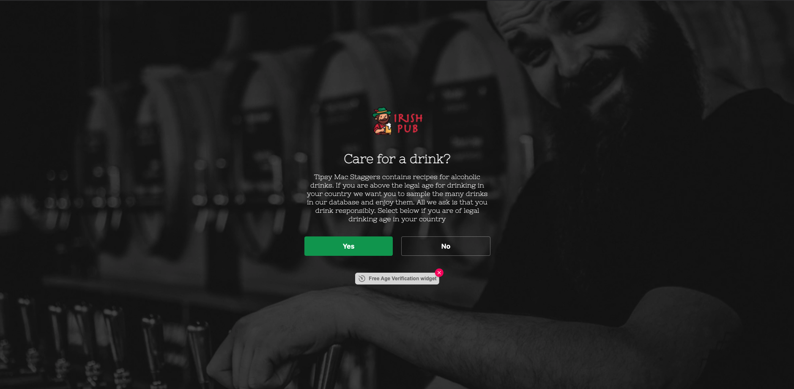
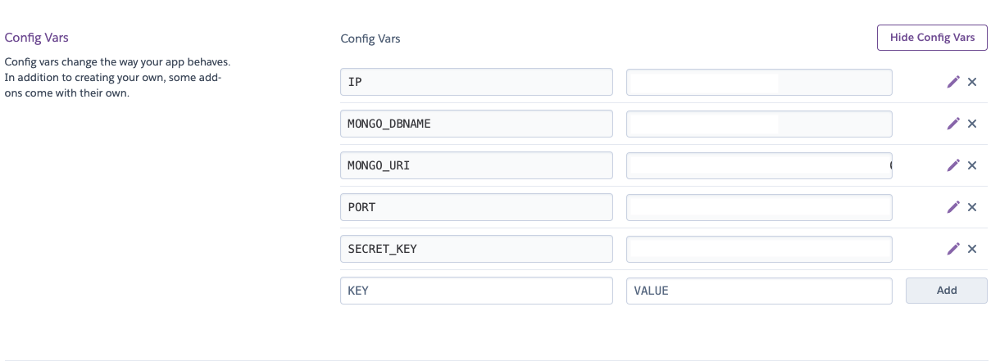

# **Tipsy Mac Staggers** #

## **Introduction** ##

The Tipsy Mac Staggers website was created and built by Stephen Mc Govern. The aim of the website is to act as a drinks database where users can search for a new drink/cocktail that they wish to try. The site will provide all of the ingredients, quantities and instructions to make each drink.

Only registered users will also be able to upload their own cocktail/drinks recipes that they have made so other users can sample another users twist on an established classic drink. 

## **Table of contents** ## 

## **1. User Experience (UX)** ##
* 1.1 Target audience
* 1.2 Visitor goals
* 1.3 User stories
* 1.4 Design choices
* 1.5 Wire frames

## **2. Features** ##
* 2.1 Age verifier
* 2.2 The navbar
* 2.3 Search drinks feature 
* 2.4 Add drink
* 2.5 Shop
* 2.6 LogIn
* 2.7 Log out
* 2.8 The Footer 

## **3. Technologies/Languages Used** ##
* 3.1 Gitpod
* 3.2 HTML5
* 3.3 CSS
* 3.4 JavaScript
* 3.5 JQuery
* 3.6 Python
* 3.7 Flask
* 3.8 Mongo DB
* 3.9 Materialize
* 3.10 Google fonts
* 3.11 Font Awesome
* 3.12 W3schools
* 3.13 Balsamiq
* 3.14 Age Verifier 
* 3.15 Favicon Generator 

## **4. Testing** ##
* 4.1 See [testing.md](testing.md) document 

## **5. Deployment** ##
* 5.1 Deployment
* 5.2 Cloning
* 5.3 Cloning Desktop

## **6. Credits** ##
* 6.1 Media
* 6.2 Code 
* 6.3 Acknowledgements

## **7. Contact Me** ##
* 7.1 LinkedIn
* 7.2 Email
* 7.3 Skype

## **8. Disclaimer** ##
* 8.1 Disclaimer on project

## **1. User Experience (UX)** ##
 

### **1.1 - Target Audience** ###

* This website is aimed at anyone who is looking for instructions on how to make a cocktail/drink that they may not be familiar with or are unsure about what ingredients, quantities and steps to follow to make that drink. The site is built around user engagement and all users are encouraged to register which will allow them to add their own favorite drinks to the site. The more registered users generating content the better the site will become. 

### **1.2 - Visitor goals** ###

 As a user of the site my goals are:

* To be able to search through a database of drinks that users have uploaded so i can try and make a classic drink i am already familiar with, or explore and find a drink that i have never tried before. 
* Once i have found a drink i want to know what ingredients i need, and the step by step instructions to make that drink. 

### **1.3 - User Stories** ###

**As a visitor to Tipsy mac Staggers i want/expect/need:**

1. A simple user friendly site where i can find information of different types of cocktails/drinks that i am looking to try. 
2. I want the layout of the site to be simple and intuitive. I want it to make sense so I am not confused or put off using it.
3. The information should be presented in a uniform way and be laid out in a way that is easy for me to navigate and to understand.
4. I also want the ability to search for and to view only drinks/ingredients that i am interested in so i am able to filter out content that is not relevant to my search.
5. I may be viewing the site from a mobile phone or tablet. I expect the site to have been designed responsively so that it works on my mobile device.
6. On mobile devices the site should work similarly to the way it does on desktop so i am able to navigate it and not be faced with a completely different layout/functionality.
7. I want the ability to add my own drinks to the website so i can share some of my own favorite recipes with other people. I also expect to be able to edit and delete my own content at any time should i wish to do so. 
8. I also expect to be able to connect to the sites social media channels with a simple click so i can keep up to date with anything that the site admins may post there. 
9. Finally as a user I expect feedback from the website when I interact with it. If i add a drink, edit a drink, delete a drink or log in and log out i want to see confirmation that this action has been completed successfully. 

### **1.4 - Design Choices** ###

* As the website is a site used for cocktail/drink recipes I wanted it to be bright and colorful, yet simple and easy to use. On this project i have intentionally kept the site as simple as possible with basic functionality. One of the main reasons i have done this is because users using the site may be doing so under the influence of alcohol. Alcohol effects memory and concentration and therefor i didn't want a complicated site with lots of features, just a simple site with CRUD functionality. 

**FONTS**

* For the website i decided to use the google font style of Nixie One. This font is a mixture of neon tubes signage and a typewriter and it is a font that sits well with the colour scheme i went with. 

* The link to the Nixie One font on Google Font can be found by clicking: [Here](https://fonts.google.com/specimen/Nixie+One?query=nix#standard-styles)

**ICONS**

* I also decided to incorporate some icons throughout the website. I did this because icons give a more visually pleasing experience for the user and also create a more intuitive user experience. For the social media icons i used (Instagram, YouTube, Facebook, Twitter) All the social media icons are located in the footer of the page.

* Some of the icons on the site were taken from the Font Awesome website. The link to the Font Awesome website can be found by clicking: [Here](https://fontawesome.com/)

* The other icons i used were direct from Materialize. They can be viewed by clicking [Here](https://materializecss.com/icons.html)

**COLOURS**

* I used the website Coolors when deciding on which colours to use. This free website uses a generator to run through different colours and palettes that will match and compliment each other. The website can be found by clicking this link: [Click Here](https://coolors.co/)

* For the base colours i decided to go with the following colour palette:

 

### **1.5 - Wire Frames** ###

[HomePage Desktop Unregistered](https://ibb.co/rx2VtBW) 
[HomePage Desktop Registered](https://ibb.co/S34XShR) 
[HomePage iPad](https://ibb.co/X4TThwq) 
[HomePage iPhone](https://ibb.co/T4J0qHL) 
[HomePage Desktop Drinks Section Unregistered](https://ibb.co/gtqbRBy) 
[HomePage Desktop Drinks Section Registered](https://ibb.co/StjWGv3) 

[Shop Page Desktop Unregistered](https://ibb.co/6bLY7cM) 
[Shop Page Desktop Registered](https://ibb.co/z60jqPP) 
[Shop Page iPad](https://ibb.co/6t15h5K) 
[Shop Page iPhone](https://ibb.co/ZfZnGFd) 

[Register Page Desktop](https://ibb.co/gvzCgN8) 
[Register Page iPad](https://ibb.co/3y8Mtwd) 
[Register Page iPhone](https://ibb.co/93d5Lk6) 

[Login Page Desktop](https://ibb.co/7bCYx5R) 
[Login Page iPad](https://ibb.co/M9XtHjY) 
[Login Page iPhone](https://ibb.co/G5fkM2N) 

[Welcome Back Page Page Desktop](https://ibb.co/N1WJMZQ) 
[Welcome Back Page iPad](https://ibb.co/vzYJ97v) 
[Welcome Back Page iPhone](https://ibb.co/c3kQT0z) 

[Add Drink Desktop](https://ibb.co/FBxgLRJ) 
[Add Drink iPad](https://ibb.co/GktKQGX) 
[Add Drink iPhone](https://ibb.co/HgmX2Nn) 

## **2. Features** ## 
 

### **2.1 - AGE VERIFIER** ###

When a user lands on the website for the first time they will see the Age Verify page/function. 

As the website contains content on alcoholic drinks to be responsible i have added an age verifier to the site. This feature doesn't ask users to enter their date of birth because the legal age of drinking can vary from country to country. Instead we ask the user to click yes or no to confirm if they are the legal age for drinking in their country.

### **2.2 - THE NAVBAR** ###

For the Navbar i decided to use a Materialize mobile collapse navbar. I chose this option because i wanted the Navbar to be responsive on all screen sizes and the Materialize mobile collapse navbar offers this function in a quick and easy way. 

The Navbar on each page is standardized, the page name "Tipsy Mac Stagger's" is located on the left hand side of the navbar. On the right hand side there are `<a>` tags that link to different pages. A registered and logged in user will see different buttons/options than an unregistered user. For an unregistered user the buttons/options they will see are:   

1. Home
2. Shop
2. Register
3. Log In

(Image Below)

For an registered user the buttons/options they will see are:   

1. Home
2. Add Drink
3. Shop
4. Log Out

(Image Below)

On smaller screen sizes the navbar buttons will collapse into a hamburger menu on the right hand side and the name "Tipsy's" will move to the middle of the navbar.

 

When the user clicks on the hamburger the menu will open from the right hand side to reveal the page options.
 
 

 

### **2.3 - SEARCH DRINKS** ###

At the top of the home page i have created a search bar for users to search for drinks. If a user wishes the can browse all the drinks listed on the website one by one, or to save time they can use the search feature. 
 

I have set this functionality up so users can search by: Drink name, drink type (Whiskey, Vodka, Rum) and by drink ingredient. 

Initially when i first built the site i was going to have only the search bar showing on the homepage (See image below).

However i did want users to be able to browse all of the drinks on the website on a single page as part of the idea behind the site is to be able to find  search, find drinks/cocktails users may have never have even heard of. I believe the search bar only page would have acted as a barrier to this. I also wanted to have a page that displayed all the drinks on the website so they could browse everything on one page (See image below).

**CONCLUSION** 

After building both of these pages and testing them i felt it was not a pleasant user experience as it was listing the drinks and search on 2 different pages and was just duplication and i didn't feel it gave a positive user experience. 

For this reason i decided to scrap the all drinks page and the search only page and combine the 2 pages into one. Now on the home page of the site users can browse all of the drinks on one single page and they also have the search functionality on this page as well. 

### **2.4 - ADD DRINK** ###

Users of the site who register will have the ability to add drinks to the website. The add drink button will only be visible to registered users, none registered users will not have the ability to submit drinks. 
 

The data the site collects from each user uploading a drink is:

1. Drink name
2. Drink type (Ex: Whiskey, Vodka, Rum) 
3. Ingredients necessary 
4. Step by step instructions 
5. Preparation time (In minutes)
6. Serves (Number of people)

### **2.5 - SHOP PAGE** ###

I have added a shop page to the website. The majority of cocktails will require you to use specific items to make the drink correctly. Users of the site who are new to making their own cocktails may not know what these items are or where to purchase them so i have created a "Shop Now" button with a link to Amazon where users can browse full cocktail making sets that can be delivered to their door. 

 

At the time of writing this README file (June 2021) the Amazon link is functioning normally and as intended. As the Amazon site is constantly updated this link may need adjusting, but as of the time of writing this README the link is working as normal. 

### **2.6 - LOG IN** ###

Registered users who are returning to the site will need to log in if they wish to edit any of their submitted content or to add a new drink. The login page is simple and only requires the username and password. 

I have also added a redirect under the login button. This displays the message to users that if they are new to the site they need ot register for an account. The link here will bring them to the user register page.

When the user logs in successfully they will be brought to a welcome back landing page. 

From here they can navigate around the site as normal. They can access the drinks page by clicking the home button in the navbar, or by clicking the search Drinks button below the welcome back image. 

### **2.7 - LOG OUT** ###

The logout button is on display to all logged in users. Once a user clicks on logout they will be logged out of the site and get a confirmation message that their session has ended. 

### **2.8 - THE FOOTER** ###

I have chosen a very basic footer for the website. The footer contains just the social media links and some information about the site in the sub footer. The footer is identical on each page to maintain consistency no matter what page the user finds themselves on.

## **3. Technologies/Languages Used** ##
 

* 3.1 - [Gitpod](https://www.gitpod.io/) - Is the IDE recommended for Code Institute students and the one i chose to develop this project in.
* 3.2 - [HTML5](https://html.com/html5/#What_is_HTML) - This is the markup language i used for this project. 
* 3.3 - [CSS](https://en.wikipedia.org/wiki/CSS) - I used CSS to help alter and adjust the presentation of the website to create a pleasant user experience. 
* 3.4 - [JavaScript](https://en.wikipedia.org/wiki/JavaScript) - JavaScript often abbreviated as JS, is a programming language that conforms to the ECMAScript specification. Alongside HTML and CSS, JavaScript is one of the core technologies of the World Wide Web. 
* 3.5 - [JQuery](https://jquery.com/) - jQuery is a fast, small, and feature-rich JavaScript library. It makes things like HTML document traversal and manipulation, event handling, animation, and Ajax much simpler with an easy-to-use API that works across a multitude of browsers.
* 3.6 - [Python](https://www.python.org/) - Python is an interpreted high-level general-purpose programming language. Python's design philosophy emphasizes code readability with its notable use of significant indentation. Its language constructs as well as its object-oriented approach aim to help programmers write clear, logical code for small and large-scale projects.
* 3.7 - [Flask](https://flask.palletsprojects.com/en/2.0.x/) - Flask is a micro web framework written in Python. It is classified as a microframework because it does not require particular tools or libraries. It has no database abstraction layer, form validation, or any other components where pre-existing third-party libraries provide common functions.
* 3.8 - [Mongo DB](https://www.mongodb.com/) - For this project i used Mongo DB for the database. 

MongoDB is a fully managed cloud based database. Classified as a NoSQL database program, MongoDB uses JSON-like documents with optional schemas. For this project all of the content is hosted on Mongo DB. 

This particular project has has 3 collections in the database. All of the fields are strings and the database structure can be viewed below: 

* 3.9 - [Materialize](https://materializecss.com/) - Materialize is a CSS Framework similar to Bootsrap for developing responsive websites. Materialize 1.0 is the version i used for the development of this project. I chose to use Materialize for this project because i had never used it before and wanted to see how it stacked up compared to Bootstrap.
* 3.10 - [Google fonts](https://fonts.google.com/) - Launched in 2010 Google Fonts is a library of 1,023 free licensed font families. For this project i went with the google font of Nixie One.
* 3.11 - [Font Awesome](https://fontawesome.com/) - Font awesome is world's most popular and easiest to use icon set. Users have access to thousands of different icons that will cover nearly every icon you are looking for and incorporating them into your website is very easy. 
* 3.12 - [W3schools](https://www.w3schools.com/) - One of the first ports of call for any developer. It has a vast amount of content and code tutorials that will help explain how code works. A great free resource for every developer. 
* 3.13 - [Balsamiq](https://balsamiq.com/) - Balsamiq Wireframes is a small graphical tool to sketch out user interfaces for websites and web / desktop / mobile applications. I used Balsamiq to formulate my initial ideas for the site so i could visualize how the site would look and also be able to gage the scope of the project. 
* 3.14 - [Age Verify](https://ageverify.com/) - AgeVerify is a website age checker, pop up splash entry page & age verification pop-up script that easily integrates in to your existing website with a single line of code, brought to you by the fine folks at Imbibe Digital.
* 3.15 - [Favicon](https://favicon.io/favicon-generator/) - A free and simple website that allows you to create, build and customize your Favicons for your own site. 

## **4. Testing** ##
 

Testing information can be found in the [testing.md](testing.md) file

## **5. Deployment** ##
<!--  

### **5.1 DEPLOYMENT** ###

To deploy the site on Github i undertook the following steps:

Requirements:

* Python 3
* Github account
* Mongo DB account 
* Heroku account  -->

<!-- 1. Navigated to my profile page on Github
2. Selected this project from the repositories
3. Clicked on settings
4. Scroll down to the Github pages section
5. Click where is says source and in the dropdown menu select master
6. Click on the next dropdown menu to the right select /(root)
7. Click save

You will then receive a confirmation saying the page has been published and also be provided with the link where people can view your site.

The link to view the published site can be found by clicking [Here](https://smcgdub.github.io/MS3_Project_Tipsy_Mac_Staggers/)

Link: https://smcgdub.github.io/MS3_Project_Tipsy_Mac_Staggers/ -->

### **5.2 CLONING** ###

If you wish to make a local copy of this website you can do so by cloning it. 

1. First you must create a Database in Mongo DB. If you don't have a Mongo DB account you can open one by clicking [Here](https://www.mongodb.com/cloud/atlas)
2. Once your signed up create a cluster and a database.
3. Create 3 collections in the database: users, drinks and categories. 
4. The structure i used for my database on Mongo DB can be found below. You must set yours up the same way if you are looking to clone the site. 

Now your DB is set up you can clone the repository from Github. The link to the repository which can be found on Github by clicking [Here](https://github.com/smcgdub/MS3_Project_Tipsy_Mac_Staggers) 

You will need to follow the instructions on how to clone a Github repository, these instructions can be found by clicking [Here](https://docs.github.com/en/github/creating-cloning-and-archiving-repositories/cloning-a-repository-from-github/cloning-a-repository#cloning-a-repository-to-github-desktop) 

<em>**Note:** In terminal when you type git clone and then paste the URL you it should look like this `$ git clone https://github.com/smcgdub/MS3_Project_Tipsy_Mac_Staggers`</em> 

Now you will also need to create your own env.py file and store the necessary environment variables in it. To do so securely you must 

1. Create a gitignore file in your root directory
2. Then create an env.py file
3. Add the following variables to your env.py file:

- Import os
- os.environ.setdefault("IP", "enter value")
- os.environ.setdefault("PORT", "enter value")
- os.environ.setdefault("SECRET_KEY", "enter value")
- os.environ.setdefault("MONGO_URI", "enter value")
- os.environ.setdefault("MONGO_DBNAME", "enter value")

4. Add your env.py file to the gitignore file. (This is essential to ensure your confidential details will not be pushed into the public domain)

### **Deployment to Heroku** ###

1. Create an account on Heroku if you do not have one. You can create an account by clicking [Here](https://signup.heroku.com/) 
2. Click the new button and then click on "Create new app" 

3. Enter an app name. On Heroku your app name must be unique, so you can not call it the same as mine. You must then select the region closest to you. 

4. If you have already cloned the files to your Github account then the easiest way to sync to Heroku is via Github. Click on "Deploy" in the menu and then click on "Connect to Github" 

5. Search for the repository name and once you've found it press the connect button.

6. Before you can click on "Enable Automatic Deploys" you must first enter the variables that are in your hidden env.py file. To do this click on "Settings" and then click on the "Reveal config vars" button 

7. You will need to enter the following variables for your version of the project. The variables you will need are: 

* IP Address
* PORT
* SECRET_KEY
* MONGO_URI
* MONGO_DATABASE

Add the variables (Example below):

8. Once all the hidden variables have been entered click on the deploy tab, scroll down to where you see the "Enable Automatic Deploys" button and click it (Main should be selected unless you want other branches to be deployed)

9. When the app is has been deployed by Heroku you will get a confirmation message confirming the deployment. Click the view button to view the deployed app.

<!-- ### **5.3 CLONING DESKTOP** ###

You can also clone the project using Github Desktop. To do this you can do the following:

1. Download Github Desktop if you do not already have it installed. The link can be found here: [GitHub Desktop](https://desktop.github.com/)
2. Sign in to GitHub and GitHub Desktop before you start to clone.
3. On github navigate to the project repository. The link can be found here: 
4. Click on the tab that says < >code
5. Above the files, click the button that says ↓code
6. Click open with GitHub Desktop to clone and open the repository with GitHub Desktop.
7. Click Choose... and, using the Finder window, navigate to a local path where you want to clone the repository
8. Click clone -->

## **6. Credits** ##
 

### **6.1 MEDIA** ###

* Image of cocktail on the shop page 
Photo by [Kaufmann Mercantile](https://unsplash.com/@kaufmann_mercantile) 
[Image here](https://unsplash.com/photos/Bf5B06xmA3Q)

* Image of welcome back sign 
Photo by [Nick Fewings](https://unsplash.com/@jannerboy62) 
[Image Here](https://unsplash.com/photos/bTRsbY5RLr4)

### **6.2 CODE** ###

* The HTML and CSS code i used Materialize version 1.0. The official Materialize site documentation is the best place to reference for everything you need. [Materialize Documentation Here](https://materializecss.com/)
* I used some JQuery to achieve the slideDown effect on each page load. The official JQuery website has lots of documentation. [JQuery Documentation Here](https://jquery.com/)
* For the database i chose to use Mongo DB. The Mongo DB website has all of the official documentation that you can reference. [Mongo DB Documents Here](https://docs.mongodb.com/)
* The code i used for the select validators on the add drink and edit drink dropdowns was found on Github. The code i used was posted by [Tom Freudenberg](https://github.com/TomFreudenberg). The Link to the code on Github can be found [Here](https://github.com/Dogfalo/materialize/issues/1861#issuecomment-275121774)

### **6.3 ACKNOWLEDGEMENTS** ###

* Thank you to all of the tutor team at Code Institute who were always on hand whenever i needed their support.
* A big thank you to my mentor Dick Vlaanderen who always gives me great feedback on my ideas and is able to point me in the right direction.
* A final big thank you to all of the other students, CI alumni and CI staff who were always willing to help out and advise on the official CI Slack channels.

## **7. Contact Me** ##
 

If you need to reach me i can be contacted via the three methods below:

7.1 - [LinkedIn](https://www.linkedin.com/in/stephenmcgovern01/) 
7.2 - [Email](mailto:stephen_xyz1@hotmail.com) 
7.3 - [Skype](https://join.skype.com/invite/ndruMu7qVuKZ)

## **8. Disclaimer** ##
 

8.1 - This website and all of its content was completed for my personal assessment and is strictly for educational purposes only.