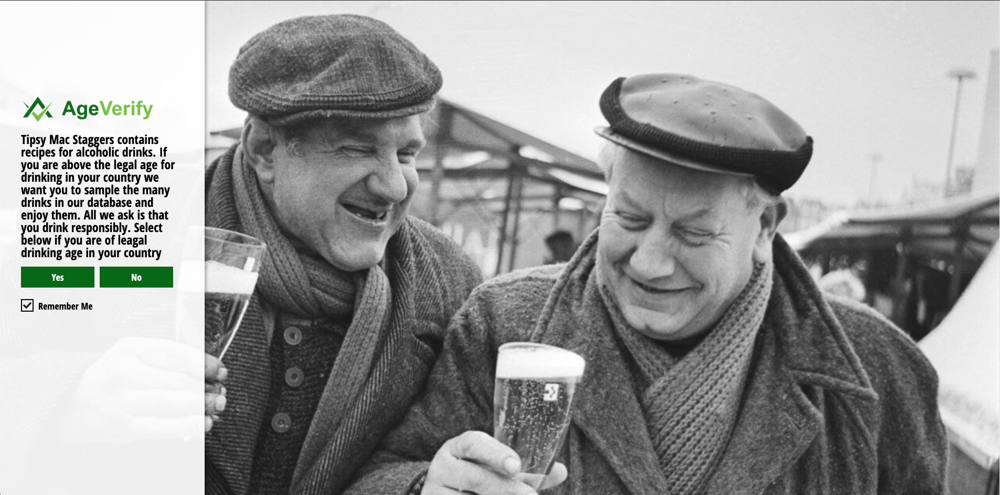
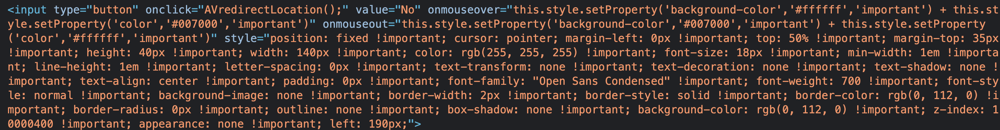
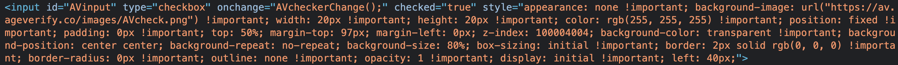

# **Tipsy Mac Staggers - Testing** #

>
## **Table of contents** ##

### **1. Automated Testing** ###

* 1.1 HTML Code Validating 
* 1.2 CSS Code Validating 
* 1.3 JavaScript Validating
* 1.4 Python Validating

### **2. Manual Testing** ###

* 2.1 Manual testing desktop
* 2.2 Manual testing mobile

>

### **1. Automated Testing** ###

**1.1 HTML Code Validating**

* All of the HTML files were tested on the [W3C HTML Markup Validation website](https://validator.w3.org/)
* All of the files came back clear with the result of **"Document checking completed. No errors or warnings to show"**

**1.2 CSS Code Validating**

* The main CSS files were tested on the [W3C CSS  Validation website](https://jigsaw.w3.org/css-validator/) 
* All of the files came back clear with the result of **"Congratulations! No Error Found."**

**1.3 JavaScript Code Validating**

The testing for the script.js file was carried out on [JShint.com](https://jshint.com/) The results from the test were as follows:

**1.4 Python Code Validating**

>

### **2. Manual Testing** ###

**2.1 Manual testing desktop**

All desktop testing was carried out on Chrome, FireFox and Safari. 

**1. Age Verifier**

When the user lads on the site the age verification page will load before the site does. Users are greeted with a message informing them the website contanis drink recepies of an alcoholic natre and asks them to confirm if they are of the legal drinking age in their country. They have the option to click "Yes" or "No". 

* If they click yes they will be brought to the main page of the website. 

* If they click no they are redirected away from the site and brough to the homepage of AgeVerify. As i am using the free AgeVerify product i have very limited settings i can adjust, the redirect appears to be one of them. The screenshot from dev tools is below showing the onclick redirect on line 1: `onclick="AVredirectLocation();"`

However with the free product i have used for this project i dont seem to have the ability to adjust this. 

Under the yes and no buttons there is also a checkbox with the text "Remeber me". Users would tick/untick this box depending on their preferecnce. Again as i am using the free AgeVerify product i dont have the ability to adjust this 

Using dev tools you can see the code on line 1 is set to: `checked="true"`

With the free product there doesnt seem to be a way to adjust this. It is something i am aware of and may address at a later date.

**1. Navbar**

* Have clicked on the Tipsy's text on the left hand side of the Navbar. Can confirm it brings the user back to the drinks.html landing page.
* Have clicked on each item in the Navbar and can confirm the page then brings to user to that section.
* Can confirm on smaller screen sizes and mobile devices the list items in the Navbar collapse and now appear as a hamburger menu. When pressed the menu expands to show items. 

**10. The Footer**

* The footer of each page contains the social media icons and the links to those social media sites. 
* I have tested all of the social media links behind the icons on each page and they all point to the correct social media site relative to the icon. When clicked the social media site will open in a new tab/window 

>

**2.1 Manual testing mobile**

**1. Navbar**

* When viewing on a tablet horizontally the Navbar will display all of the list items the same as a desktop. 
* When held vertically on a tablet the Navbar will display with the hamburger menu in place. 
* On mobile phones whether held horizontally or vertically the Navbar will always appear as a hamburger menu. When pressed the hamburger menu expands to show the list items. 
* Have clicked on the Tipsy's text on the left of the Navbar. Can confirm it brings the user back to the drinks.html landing page.

**10. The Footer**

* The footer works exactly the same on mobiles and tablets as it does on desktops.  

>

### **D) Console Testing** ###

I have tested each page of the site on the console and upon loading none of the pages are showing errors or warnings. 

>

**1.4 Python Code Validating**

**A) Register Page**

Any user who wishes to contribute content to the website must first register their details and create an account. There are 5 input fields on the register page which are:

1) Users name 
2) Create username 
3) Users email 
4) Create password
5) Enter their date of birth 

* **Your Name:**  

* **Create Username:**  
Users registering on the site must create a username that is a minimum of 5 characters. To help guide new users i have created 2 pieces of placeholder text. The first piece of placeholder text prompts the user to "Create Username". The second piece of placeholder text specifies "Min 5 characters" This lets any new registering user know they have to use a minimum of 5 characters when creating their username. I have also installed some validation code in the HTML so if the user creates a username of less than 5 characters the input field will turn red and they user will be displayed a message of "Invalid Username". If the user enters the 5 characters correctly when they click on a new input field the field they populated will turn green and they will get the confirmation message "Username valid" 

**INSERT SCREENSHOT HERE**

* **Your Email:** 
Users registering on the site must also enter a valid email address. I have created some placeholder again to help guide new users. The first piece is placeholder text on this input field specifying "Your email". If the user enters an invalid email address then the field will turn red and the user will see a message saying "Invalid email address". If the user enters a correct email address then the field will turn green and the user will see the message "Email valid" 

**INSERT SCREENSHOT HERE**

* **Create Password:**  
Agin in this field i have placed some placeholder text promting the new user to "Create Password" As i did with the username i have specified in the placeholder text the password must be a minimum of 6 characters. If the user enters a password of less than 6 characters they will be greated with a message of "Invalid password". If the user enters 6 or more characters then the field will turn green. I havent added any confirmation place holder text, the field will jsut turn green to confirm the passowrd in long enough.

**INSERT SCREENSHOT HERE**