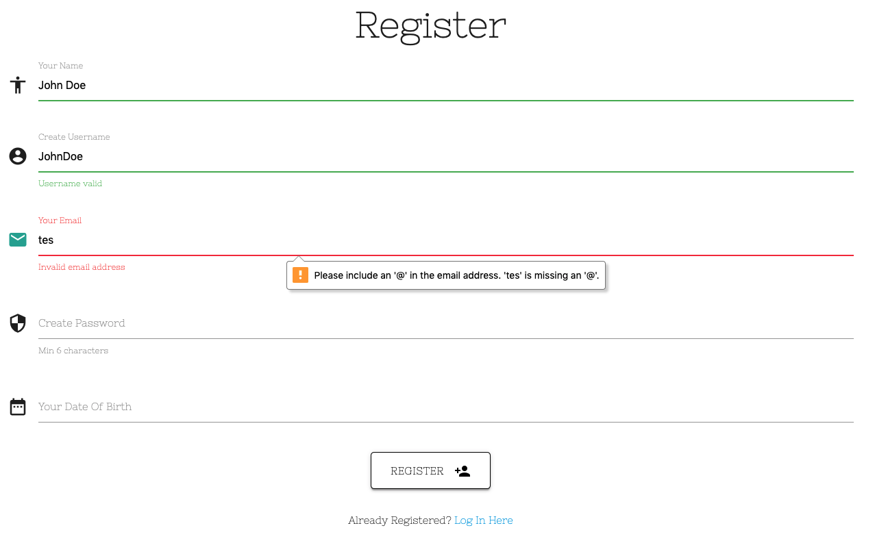
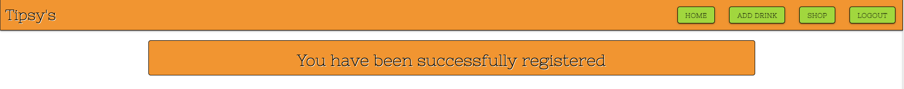
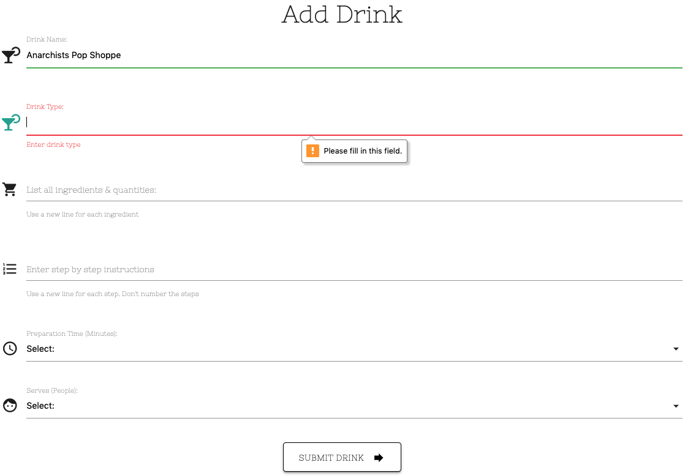

# **Tipsy Mac Staggers - Testing** #

## **Table of contents** ##

## **1. Automated Testing** ##

* 1.1 HTML Code Validating
* 1.2 CSS Code Validating 
* 1.3 JavaScript Validating
* 1.4 Python Validating

## **2. Manual Testing** ##

* 2.1 Manual testing desktop
* 2.2 Manual testing mobile

## **3. Responsiveness** ##

* 3.1 Chrome Dev Tools
* 3.2 Responsive Design Checker

## **4. Console Testing** ##

* 4.1 Console test results

### **1. Automated Testing** ###
 

**1.1 HTML Code Validating**

* All of the HTML files were tested on the [W3C HTML Markup Validation website](https://validator.w3.org/)
* All of the files came back clear with the result of **"Document checking completed. No errors or warnings to show"**

**1.2 CSS Code Validating**
 

* The main CSS files were tested on the [W3C CSS  Validation website](https://jigsaw.w3.org/css-validator/) 
* All of the CSS came back clear with the result of **"Congratulations! No Error Found."**

**1.3 JavaScript Code Validating**
 

* The testing for the script.js file was carried out on [JShint.com](https://jshint.com/) The results from the test were as follows:

* The undefined variable M on line 3 can be ignored. This is the JavaScript that was taken direct from the Materialize website to allow all of the JavaScript functions to work. 

**1.4 Python Code Validating**
 

* The testing for the python files of app.py and env.py were carried out on [pep 8 online](http://pep8online.com/) The results from the test were as follows:

### **2. Manual Testing** ###
 

**2.1 Manual testing desktop**

All desktop testing was carried out on Chrome, FireFox and Safari. 

**Age Verifier**

When the user lands on the site the age verification page will load before the site does. Users are greeted with a message informing them the website contains drink recipes of an alcoholic nature and asks them to confirm if they are of the legal drinking age in their country. They have the option to click "Yes" or "No". 

* If they click yes they will be brought to the main page of the website. 

* If they click no they are redirected away from the site and brought to the homepage of AgeVerify. As i am using the free AgeVerify product i have very limited settings i can adjust, the redirect appears to be one of them. The screenshot from dev tools is below showing the onclick redirect on line 1: `onclick="AVredirectLocation();"`

However with the free product i have used for this project i don't seem to have the ability to adjust this. 

Under the yes and no buttons there is also a checkbox with the text "Remember me". Users would tick/untick this box depending on their preference. Again as i am using the free AgeVerify product i don't have the ability to adjust this 

Using dev tools you can see the code on line 1 is set to: `checked="true"`

With the free product there doesn't seem to be a way to adjust this. It is something i am aware of and may address at a later date.

**1. Navbar**

* Have clicked on the Tipsy's text on the left hand side of the Navbar. Can confirm it brings the user back to the drinks.html landing page.
* Have clicked on each item in the Navbar and can confirm the page then brings to user to that section.
* Can confirm on smaller screen sizes and mobile devices the list items in the Navbar collapse and now appear as a hamburger menu. When pressed the menu expands to show items. 

**2. Drinks page / Homepage**

* The search bar at the top pf the page loads and is functioning as intended. Users can search via drink name, drink type or drink ingredient.
* If a user presses the search button without entering any text the verifier will turn the bar read and the user will be prompted by a popup to enter some text. 
* When a user presses the reset button the search bar will clear and the page will reload as intended. 
* The drinks on the page are all loading correctly and in alphabetical order.
* The buttons to the right of the ingredients and instructions collapsible section are working correctly and will expand the ingredients and instructions and area as intended. 
* The scroll to top button is working as intended on chrome and firefox. When the user presses the button the page will scroll to the top of the page. 
* If the user searches for a drink that isn't in the database they will get a notification that there is no drink that matches that search. They are then prompted to register and add that drink to the database. 

**ERROR DETECTED**
* However on Safari the button doesn't move up and down the page as it was intended to to. 

**3. Shop Page**

* The Shop Now button under the image and text is working as normal. At the time of writing this testing.md file (June 2021) the shop now button will open Amazon.co.uk in a new tab where eit will display the cocktail making kits. The link can be seen [here](https://www.amazon.co.uk/s?k=cocktail+maker+set&crid=3PU5P06BCME2Q&sprefix=cocktail%2Caps%2C187&ref=nb_sb_ss_ts-doa-p_9_8
)

**4. Register Page**

* If the user tries to register without completing all of the fields they will get a pop up appear asking them to complete the missing field. Screenshots are below: 

**Your Name Left Empty**
 

**Username Left Empty**
 

**Email Left Empty**
 

As you can see from the image above if the user doesn't enter a valid email address the popup will tell them an invalid text has been entered.

**Password Left Empty / Error** 
Users are required to enter a password that is a minimum of 6 characters. Users will know this because the password field has placeholder text informing the user of a minimum of 6 characters. 

 

As you can see from the image below if the user doesn't enter a valid password the popup will tell them they must use a minimum of: 1 number, 1 uppercase and 1 lowercase letter in their 6 character password.

 

**Date Of Birth Left Empty** 
With the date of birth users will be prompted to enter this if left empty. 

 

The register page is working as intended and any new user wishing to register will have to complete all fo the fields before registration will be allowed. Once all fields have been entered and registration has been confirmed the user will get a message displayed: 

 

**5. Log In** 

* On the Login page users are required to enter their username and password. If a user tries to login without entering their username they will be prompted to enter it. 

**Username Left Empty** 
 

If a user only enters their username and tries to log in they will then be prompted to provide it before logging in.

**Password Left Empty** 
 

Once the user has entered the correct username and password they will be brought to the welcome page.

 

**Incorrect details entered** 
If a user enters the wrong username, password, or both they will get a message saying the username/or password is incorrect. For security the site doesn't say if it is the username or password is incorrect to help prevent an account being hacked. 

 

**6. Add Drink**

The add drink page will only be visible to registered users who are currently logged in. Users who are adding a drink are required to enter 6 different type of information. They are:

1. Drink name
2. Drink type
3. Drink ingredients and quantities 
4. Step by step instructions 
5. Preparation time 
6. Serves (Number of people) 

* If the user tries to register without completing all of the fields they will get a pop up appear asking them to complete the missing field. Screenshots are below: 

**Drink Name Left Empty**
 

**Drink Type Left Empty**
 

**Drink Ingredients Left Empty**
 

**Drink Instructions Left Empty**
 

**Preparation Time Left Empty**
 

**Serves Left Empty**
 

**7. Log Out** 

* The logout button has been checked and when a logged in user clicks on it they are logged out of their session and they will get a confirmation message confirming the logout. 

 

**8. The Footer**

* The footer of each page contains the social media icons and the links to those social media sites. 
* I have tested all of the social media links behind the icons on each page and they all point to the correct social media site relative to the icon. When clicked the social media site will open in a new tab/window.

 

**2.1 Manual testing mobile**

To reduce repetition of the desktop results, for the mobile testing i have just highlighted the different functionalities that mobile users may experience while using the site on a mobile device. I have carried out all of the exact same manual tests on mobile devices as i did on the desktop however unless highlighted below, readers of this document can know i experienced the exact same outcomes on mobile devices as i did on desktop.  

Mobile testing was carried out on the following devices: 
1. iPhone 6/7/8 (Via Chrome Dev Tools)
2. iPad (Via Chrome Dev Tools)
3. Huawei P20 lite
4. Huawei P smart
5. Chuwi h9 pro 

**1. Navbar**

* When held vertically on a tablet the Navbar buttons will disappear and be accessed by clicking on the hamburger menu that appears on the top right hand side. 
* When viewing on a tablet horizontally the Navbar will display all of the list items the same as a desktop. 
* On mobile phones whether held horizontally or vertically the Navbar will always appear as a hamburger menu. When pressed the hamburger menu expands to show the list items. 
* Have clicked on the Tipsy's text on the left of the Navbar. Can confirm it brings the user back to the drinks.html landing page.
* When viewing on smaller devices where the hamburger is active the text "Tipsey's" moves from the top left of the page to the center. 

**2. Drinks page / Homepage**

* All tests on mobile devices returned the same results as the desktop results listed above. 

**3. Shop Page**

* All tests on mobile devices returned the same results as the desktop results listed above. The page is functioning normally and as intended on mobile devices. 

**4. Register Page**

* All tests on mobile devices returned the same results as the desktop results listed above. The page is functioning normally and as intended on mobile devices. 

**5. Log In** 

* All tests on mobile devices returned the same results as the desktop results listed above. The page is functioning normally and as intended on mobile devices. 

**7. Log Out** 

* All tests on mobile devices returned the same results as the desktop results listed above. The page is functioning normally and as intended on mobile devices. 

**8. The Footer**

* The footer works exactly the same on mobiles and tablets as it does on desktops.  

### **4. Console Testing** ###
 

I have tested each page of the site on the console and upon loading none of the pages are showing any errors or warnings. 

There are some messages that are being populated in the console. Image below:

 

 

 

This message is coming from the Materialize JS and is nothing to do with my code. It also doesn't have any effect on the site performance. It is logged here to highlight i am aware of it. 

